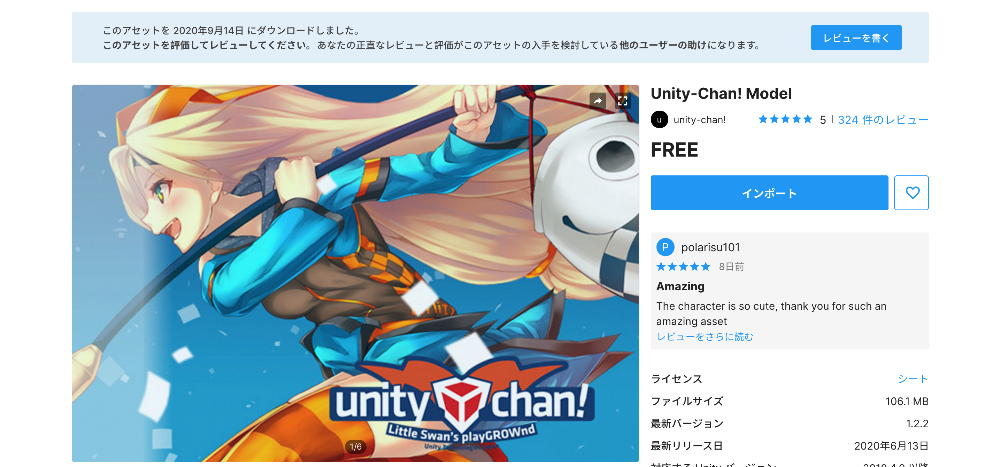

# 3人称視点ゲームの作成

## 新規プロジェクトの作成

<br>

まずは新規プロジェクトを作成します。


UnityHubを開き、右上の新規作成ボタンを押してください。

テンプレートは3Dのままで、プロジェクト名はなんでも構いません。ここでは「CharacterGame」としておきます。
保存先を決めたら作成ボタンを押します。

<br>


Unityが開けたらUnityエディタのレイアウトを任意の形にしてください。
Unityエディタの右上の「Layout」から好きなレイアウトを設定できます。
こちらの教材では「2 × 3」を利用します。

<br>

## アセットストアからインポート

### Unityちゃんのインポート

<br>

プロジェクト作成が終わったら早速アセットストアから3D素材をインポートします。


UnityのWindowタブからAssetStoreを選択します。
そうすると、このようにSceneウィンドウの場所にAssetStoreが表示されます。

<br>


このままでは少しウィンドウが小さいので、AssetStoreタブの点線アイコンから「Maximize」を選択します。

<br>


次にこちらの言語タブから日本語を選択してください。
これで日本語表記でアセットストアを表示できます。

今回はUnityJapanから公式に出されている「Unity-Chan! Model」と、Unityでゲームを作成するときに便利なアセットが入っている「Standard Assets」をインポートします。

<br>


まずはUnityちゃんをインポートします。
AssetStoreの検索バーに「Unity-Chan! Model」と記述し、検索してください。

<br>


そうすると、このようにUnityちゃんのアセットが表示されますので、こちらを選択してください。

<br>



既に別のプロジェクト等でインストールしたことのある場合はこのように「インポート」のボタンが表示されますが、初めてこのアセットをインポートする場合はこちらのボタンは「ダウンロード」になっています。

まだダウンロードしていない場合は、こちらのボタンからダウンロードを実行してください。
しばらく待っているとダウンロードが完了し、こちらのボタンが画像のようにインポートに変わります。

次にこの「インポート」ボタンをクリックします。

<br>


そうすると、このようなウィンドウが表示されますので、全てにチェックが入っているのを確認してから右下の「Import」ボタンをクリックします。

<br>


インポートが完了したらアセットストアの全画面表示を終了させてUnityエディタを開きましょう。

このようにProjectウィンドウに「unity-chan」が表示されていれば成功です。

<br>

まずはこの3DキャラクターがきちんとUnityで動作できるか確認しましょう。


プロジェクトウィンドウで「unity-chan! -> Unity-chan! Model -> Scenes -> ActionCheck」をダブルクリックで開きましょう。
そしてUnityエディタの上の方にある実行ボタンを押してください。
そして、ゲームビューで3Dキャラクターが動き出せば成功です。

また、ゲームビューに表示されているChangeMotionのNextボタンをクリックすると、画像のように次々とアニメーションが切り替わるかと思います。


<br>


動作確認ができたので元のシーン「Assets -> Scenes -> SampleScene」を開き直しておきましょう。

<br>

### スタンダードアセットのインポート

次にスタンダードアセットをダウンロードします。


先ほどと同じ要領でAssetStoreで「Standard Assets」を検索し、インポートしてください。

<br>


このようにプロジェクトウィンドウにStandartAssetsのフォルダが表示されていればOKです。

<br>

## プレイヤーを動かす

次に3Dキャラクターを動かすようにしたいと思います。


まずはヒエラルキーウィンドウからPlaneを作成して配置してください。
そして名前を「Ground」に変更し、Scaleをx: 4、y: 1、z: 4に変更します。


次にプロジェクトウィンドウから「unity-chan! -> Unity-Chan! Model -> Prefabs」を開き、その中から「Unitychan_dynamic」をヒエラルキーウィンドウにドラッグ&ドロップしてください。

これでUnityちゃんをゲームビューの正面に配置することができました。

<br>


次にUnityちゃんを動かすようにしたいのですが、まずはこちらのエラーを解決したいと思います。

コンソールウィンドウを開くと、このように大量のエラーが出てしまっています。

色々条件があるのですが、今回は１番のエラーの問題点であるこの行

```
Assets/Standard Assets/Utility/SimpleActivatorMenu.cs(12,16): error CS0619: 'GUIText' is obsolete: 'GUIText has been removed. Use UI.Text instead.'
```

こちらを修正したいと思います。

このエラーを簡単に説明すると、「SimpleActivatorMenuスクリプトの12行目のGUITextは旧形式での記述方法なので修正してください」という意味になっています。

ですので、VisualStudioでこのスクリプトを開きます。

<br>


そしてプログラムを上記の画像のように変更してください。

```c#
using UnityEngine.UI;
```
でこのファイル内でUIパーツを扱えるように宣言をし、

```c#
public Text camSwitchButton;
```
でGUIText型をText型に変更しました。
これでエラーが消えるかと思いますので、保存してUnityに戻りましょう。

<br>


きちんと動くかどうか一度Unityを実行してみましょう。
問題なく起動できていれば成功です。
残りのエラーも全て消えました。

<br>


次にヒエラルキーでUnityちゃんを選択し、インスペクターウィンドウのAnimatorのControllerの部分を「ThirdPersonAnimatorController」に変更してください。
ThirdPersonAnimatorControllerは「Standard Assets -> Characters -> ThirdPersonCharacter -> Animator」の中に入っています。

<br>


次にunitychan_dynamicに「ThirdPersonUserControl」をドラッグ&ドロップで追加してください。
こちらは「Standard Assets -> Characters -> ThirdPersonCharacter -> Scripts」に入っています。

こちらを追加すると下の画像のように、「CapsuleCollider」「ThirdPersonCharacter」が自動でアタッチされます。

そしてカプセルコライダーとThirdPersonCharacterの値を画像のように変更してください。


これでキャラクターを動かす準備が整いました。
Unityを保存して実行してみましょう。

<br>


このようにUnityちゃんを動かせるようになっていれば成功です。

<br>


また、今回はunitychan_dynamicの「IdleChanger」と「FaceUpdate」は使用しないのでチェックを外しておきましょう。


## カメラを動かそう

これでプレイヤーを動かすことができました。
しかし、カメラが固定されていると遠くに行くとUnityちゃんが見えなくなってしまいます。
ですので、今回はUnityちゃんに合わせてカメラも一緒に移動するようにしたいと思います。


本来であればUnityちゃんを動かすのと同様に、Standard Assetsを利用すればカメラもコードを書くことなく追従させることができるのですが、今回はせっかくなので自分で追従させるコードを書いていきたいと思います。

ちなみに追従するカメラはStandardAssetsのCamerasの中のPrefabsに入っています。もし興味があったらあとで色々試してみてください。

では早速カメラを追従させていきたいと思います。
まずは一番簡単な方法からやってみましょう。
その方法とはカメラをUnityちゃんの子要素にすることです。
子要素にすると親要素、つまり一つ上の階層のオブジェクトが動けば連動して子要素も移動します。一旦試してみましょう。

<br>


まずはMainCameraのPositionをX=0、Y=2、Z=-2に変更し、RotationのXを20にしてください。
Unityちゃんがきちんとシーンの中心座標（0, 0, 0）にいればこれでUnityちゃんの後ろにカメラが配置されます。
次にこのMainCameraをunitychan_dynamicにドラッグ&ドロップしてください。そうすると、このようにMainCameraがUnityちゃんの子要素になりました。
これで一度実行してみましょう。

<br>


そうすると、このようにUnityちゃんと一緒にカメラが移動しました。
もちろんこのままでも構わないのですが、せっかくなのでコードでカメラの追従を制御してみたいと思います。

<br>


一旦MainCameraをUnityちゃんの子要素から外しておきましょう。
そしてMainCameraのインスペクターからAddComponentでNewScriptを選択してください。
そしてScript名をCameraControllerとします。
プロジェクトウィンドウに今作ったスクリプトが格納されたので新規でScriptsという名前のフォルダを作成し、そこに入れておきましょう。
そこまで終わったらVisualStudioでスクリプトを開きます。

<br>


スクリプトを開いたらコードを記述していきます。
まずはキャラクターの座標を入れるパブリック変数とキャラクターとカメラの相対距離を入れるVector3型の変数を定義します。
Startメソッドの上の方に、
```c#
public Transform target;
private Vector3 offset;
```

このように記述してください。

次にスタートメソッドでVector3型の変数offsetにカメラの座標からキャラクターの座標を引いた値を格納します。
```c#
offset = GetComponent<Transform>().position - target.position;
```
このように記述します。
最後にUpdateメソッド内でカメラの座標にキャラクターの座標位置とキャラクターとカメラの差分の距離を足した値を代入してあげます。
```c#
GetComponent<Transform>().position = target.position + offset;
```

<br>


ここまで記述できたらコードを保存してUnityに戻りましょう。
そうすると、MainCameraのCameraControllerコンポーネントにTargetの項目があるので、そこにヒエラルキーからunitychan_dymamicをドラッグ&ドロップして入れてあげます。
ここまで終わったら実行してください。
きちんとカメラがUnityちゃんを追従していれば成功です。
忘れずにUnityを保存しておきましょう。

CameraControllerスクリプトの全体のコードは以下のようになります。

```c#
using System.Collections;
using System.Collections.Generic;
using UnityEngine;

public class CameraController : MonoBehaviour
{
    public Transform target;
    private Vector3 offset;

    // Start is called before the first frame update
    void Start()
    {
        offset = GetComponent<Transform>().position - target.position;
    }

    // Update is called once per frame
    void Update()
    {
        GetComponent<Transform>().position = target.position + offset;
    }
}
```