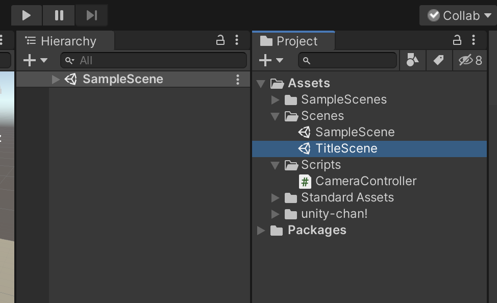
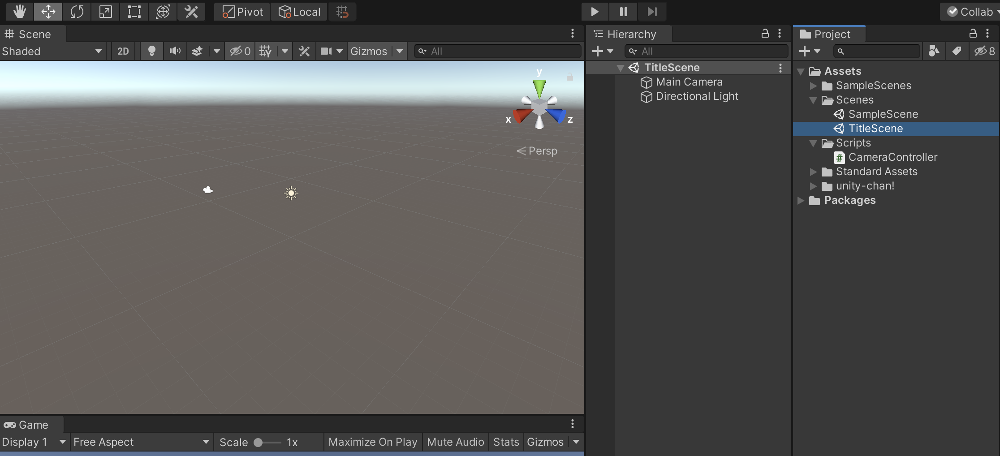
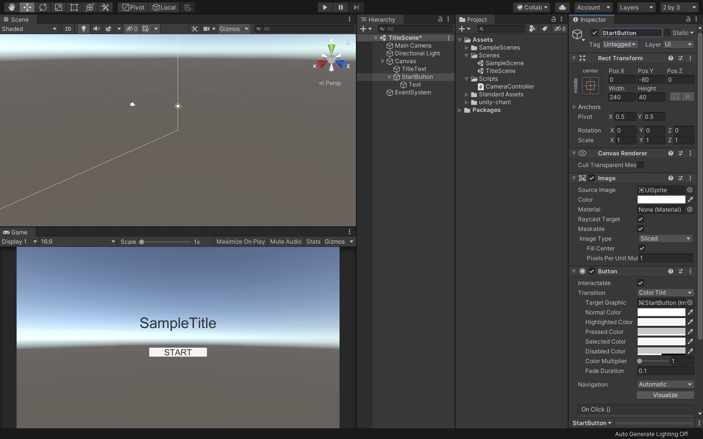

# 新規シーンの作成と画面遷移

## 新規シーンの作成

早速新規でシーンを作成したいと思います。

現在のシーンがきちんと保存してあるのを確認してください。

 

シーンの保存ができたら新規でシーンを作成します。  
プロジェクトウィンドウの＋アイコンから「Scene」を選択して下さい。

 

そうすると、新規のシーンが作成されるので、シーンの名前を「TitleScene」に変更してScenesフォルダの中に保存して下さい。

 

次に今作成したTitleSceneをダブルクリックしてこのシーンを開きます。  
新規のシーンビューが表示されていれば成功です。

 

## タイトルの表示

次にタイトル用のテキストを表示します。  
まずはヒエラルキーウィンドウから「UI -> Text」を選択します。  
そしてそのテキストの名前を「TitleText」に変更して下さい。  
そしてインスペクターから

PosX：0  
PosY：60  
Width : 320  
Height : 100  
Text : SampleTitle  
FontSize : 60  
Alignment : 上下左右ともにcenter  
に変更して下さい。

これで画面中央の少し上の方にタイトル用のテキストを配置することができました。

 

## ボタンの配置

 

 次にスタートボタンを配置したいと思います。  
 ヒエラルキーから「UI -> Button」を選択し、シーン内にボタンを配置します。  
 そしてボタンの名前を「StartButton」に変更し、  
 PosX : 0  
 PosY : -60  
 Width : 240  
 Height : 40  
 にして下さい。

 子要素のTextも変更します。
 ヒエラルキーでStartButtonの子要素のTextを選択し、  
 Text : START  
 FontSize : 32  
 にして下さい。

これでスタートボタンの配置は完了です。  
あとはこのスタートボタンを押したら先程のSampleSceneへ画面遷移させるようにします。

